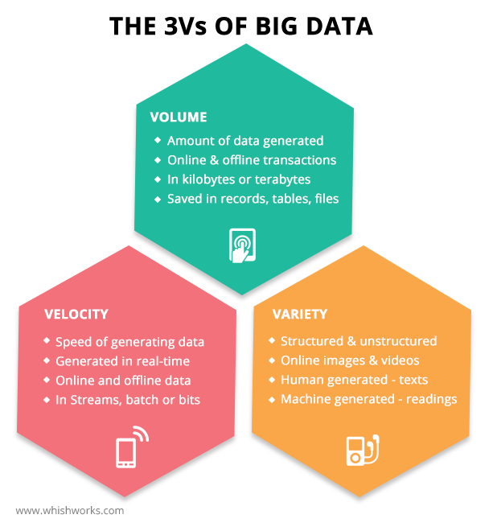

## Deadlines
- Project has to be submitted before Feb 12

## Definitions of data science
- A powerful new approach to make discoveries from data
- An automated way to analyze enormous amount of data and extract information
- A new discipline that combines aspects of statistics, mathematics, programming and visualization to turn data into information  

## Understanding terms
| Term | Significance |
| ---- | ------------ |
| Statistics | What do we do with the data ? |
| Programming | How do we do it ? |
| Domain Knowledge | Is the analysis applicable to the data |

### Example
**Statistics use case** - Imputing missing values  
**Predictive model** - Predicts the future values 90% of the data correctly, out of 100 cases 90 cases are predicted correctly  
A 90% accuracy for loan status is a good and is bad for speech to text conversion. This is where the context plays important role in deciding whether the model's accuracy is good or bad

> When we combine domain expertise and scientific methods with technology we get data science

## Domain expertise and scientific methods
- Data scientists collect data and explore analyze and visualize it. the mathematical and statistical models to find patterns and solutions in the data

### Data analysis can be:
- **Descriptive**: Study a dataset to decipher the details
- **Predictive**: Create a model based on existing information to predict outcome and behavior
- **Prescriptive**: Suggest actions for a given situation using the collected information
- **Reports**: No. of meetings done, No. of proposals, No. of account bagged, No. of invoices raised  

## Data processing and analytics
Modern tools and technologies have made data analytics faster and efficient

#### These technologies help Data Scientists to
- Build and train machine learning models
- Manipulate data and technology
- Build data tools, applications and services
- Extract information from data

## A day in a Data Scientist's life
1. Question (Example: Attrition analysis - If an employee going to resign ?)
2. Data Acquisition (Organization's database HR)
3. Data Wrangling (Data Manipulation, Cleaning and Exploration)
4. Mathematical / Statistical model
   1. Data visualization
   2. Data Report
   3. Data Products
5. Machine Learning

## Basic skills of data
#### A Data Scientist should be able to
1. Ask the right questions
2. Understand data structure
3. Interpret and wrangle data
4. Apply Statistical and mathematical methods
5. Visualize the data and communicate with stakeholders
6. Work as a team player

## Sources of Big Data
Data scientists work with different tyoes of datasets for various purposes. Now that Big Data is generated every second through different media, the role of data scientist has become more important
1. Sensors
2. Social
3. Text
4. Location
5. Image
6. Video
7. Audio
8. Server / Network logs

## The 3 V's of Big Data
Big Data us characterized by the following:
1. Volume
2. Variety
3. Velocity


## Data Analytics and Python
Python deals with each stage

## Python tools and technologies
* Pandas - Data analysis - Tabular Data - Manipulation
* Numpy - Scientific computing
* Scipy - Software of mathematics, science and engineering
* Matplotlib - Graphical computing
* Scikit-learn - Machine learning

## Benefits of Python
1. Easy to learn
2. Open source Software
3. Efficient and multi platform support
4. Huge collection of libraries, functions and modules
5. Big open source community
6. Integrates well with enterprise apps and systems
7. Greater vendor and product support

## Jupyter Notebook

### Each line in jupyter is called as a "Cell" or a "Block"

### To execute a line of python code --> click on the "run" button or press ctrl + enter  or alt + enter


```python
import sys # import sys module
```


```python
print (sys.version)

# hygiene practice to follow when we start working on a project
```

    3.7.6 (default, Apr  3 2020, 00:02:16)
    [GCC 7.5.0]


## Markdown

- Markdown helps in creating **heading and comments**
- For heading use hastags before the comment. as the number of hashtags increase the font size reduces
- With no hashtag, it will be plain comment

## Raw
# Raw input looks like the code but it doesn't run
print ('Hello World')

When we dont want the code to run and we do not want to delete it from the notebook
print ('Hello World') # Markdown


```python
print ('Hello World') # code
```

    Hello World


#### Comments in Python


```python
## Comments in a programming language in "layman" term
#  - is used to describe the code so that another programmer can understand
#  - is a good practice to document about the code

# how to code a comment in python
## use "#"
```


```python
# this is a comment
##### This is also a commnet
```


```python
# Example of InLine comment

print ("hello")              # 1st print statement
print ('Second Statement')   # Second print statement
```

    hello
    Second Statement


```python
# To comment and uncomment multiline or single comment in the code line
# ctrl + /     Forward Slash: /

print (Basic Python) # SyntaxError: invalid syntax - we havent used quotes

```


      File "<ipython-input-8-b0e9b02948f9>", line 4
        print (Basic Python)
                          ^
    SyntaxError: invalid syntax


```python
print ("Basic Python")
print ('Basic Python')

# Qoutes can be single or double
```

    Basic Python
    Basic Python


```python
# hello   world

print('hello \tworld') # prints with a tab between hello and world

# \t - tab

# backslash \
```

    hello 	world


```python
# hello   
# world

print('hello \nworld') # splits hello and world in two lines

# \n - enter
```

    hello
    world


```python
# apostrophe
print ("don't")
```

    don't


```python
# apostrophe
print ('don't')
```


      File "<ipython-input-15-7369366d7e39>", line 2
        print ('don't')
                    ^
    SyntaxError: invalid syntax


```python
# apostrophe
print ('don\'t')
```

    don't


```python
# use of apostrophe
print ('it\'s a scorching hot pizza')  ### with escape sequence \
print ("it's a scorching hot pizza")   ### without escape sequence
```

    it's a scorching hot pizza
    it's a scorching hot pizza


## Variables

# Assignments


```python
x = 3 # Assigning a value 3 to a variable x (Python Object)
print (x)
```

    3


```python
print (y)
# NameError: name 'y' is not defined
```


    ---------------------------------------------------------------------------

    NameError                                 Traceback (most recent call last)

    <ipython-input-2-451ca8f462d9> in <module>
    ----> 1 print (y)


    NameError: name 'y' is not defined


```python
y = 89
print (y)
```

    89


```python
x = 5 # Assigning a value 5 to a variable x
print (x)

# always consider latest assignment
```

    5


# Naming


```python
credit_score = 98
print(credit_score)
```

    98


```python
credit.score = 89
print(credit.score)
```


    ---------------------------------------------------------------------------

    NameError                                 Traceback (most recent call last)

    <ipython-input-6-a7b89bd88f97> in <module>
    ----> 1 credit.score = 89
          2 print(credit.score)


    NameError: name 'credit' is not defined


```python
creditscore = 98
print (creditscore)
```

    98


```python
89creditscore = 90
print (89creditscore)
```


      File "<ipython-input-8-caed379fc3b4>", line 1
        89creditscore = 90
                    ^
    SyntaxError: invalid syntax


```python
credit score = 98
print(credit score)
```


      File "<ipython-input-9-9426171c0964>", line 1
        credit score = 98
                   ^
    SyntaxError: invalid syntax


### Naming Rules for a variable name

- long names
- letters and numbers but it should *not* begin with the number
- can have an underscore but not a period (.)
- Cannot have a space

# Type of Variables


```python
# Integer

x = 10
print ('the type of variable x is = ', type(x))

# class is the data type
```

    the type of variable x is =  <class 'int'>


```python
# Float

y = 3.8
print ('the type of variable is = ', type(y))
```

    the type of variable is =  <class 'float'>


```python
# String

z = "jupyter"
print ('the type of variable is = ', type(z))
```

    the type of variable is =  <class 'str'>


```python
# boolean

a = True
print ('the type of variable is = ', type(a))
```

    the type of variable is =  <class 'bool'>


```python
# String

z = DataSciencewithPython
print ('the type of variable is = ', type(z))

# NameError: name 'jupyter' is not defined
# when DataSciencewithPython is not in qoutes, it will be considered as a variable and python will check if it is defined or not
```


    ---------------------------------------------------------------------------

    NameError                                 Traceback (most recent call last)

    <ipython-input-14-e283433d9453> in <module>
          1 # String
          2
    ----> 3 z = DataSciencewithPython
          4 print ('the type of variable is = ', type(z))


    NameError: name 'DataSciencewithPython' is not defined


```python
y = 2.1
y
z = 3.5
print z # SyntaxError: Missing parentheses in call to 'print'. Did you mean print(z)?
```


      File "<ipython-input-15-81d701b012a4>", line 4
        print z
              ^
    SyntaxError: Missing parentheses in call to 'print'. Did you mean print(z)?


**for print the variable should be in brackets**


```python
y = 2.1
y # without the print command anything in middle of the code will not be printed
z = 3.5
print (z)
```

    3.5


```python
y = 2.1
print (y)
z = 3.5
print (z)
```

    2.1
    3.5


```python
y = 2.1
print (y)
z = 3.5
z
```

    2.1


    3.5


```python
# print without print() function
"hello world"
```


    'hello world'


```python
2
```


    2
