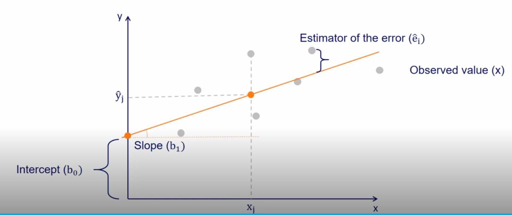

## Correlation
Correlation coefficients are values from -1 to +1, where:  
* -1 shows very strong negative Correlation  
* 0 shows no Correlation  
* +1 shows very strong positive Correlation  

> **Correlation does not imply causation.** Some variables are strangely correlated while others are unexpectedly uncorrelated.

| Correlation | Regression |
| ----------- | ---------- |
| Relationship | One variable affects the other |
| Movement together | Cause and effect |
| Symmetrical (ρ(x,y) = ρ(y,x)) | One way |
| Single point | Line |

### Graphical Representation of Linear regression model
ŷi = b0 + b1xi  

